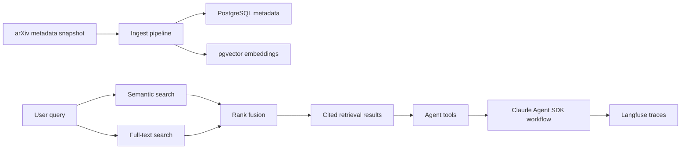

# arXiv RAG Project

[](https://github.com/shaversj/arXiv-rag-project/actions/workflows/ci.yml)


[](LICENSE)

A hybrid retrieval and agent-tooling foundation for working with arXiv papers.

The project demonstrates a practical RAG architecture over research metadata: pgvector semantic search, PostgreSQL full-text search, rank fusion, retrieval evals, Claude Agent SDK tools, and Langfuse observability.

## Try It

Run the fast repository checks:

```bash
uv sync
uv run pytest tests/test_repo_surface.py tests/test_agent_tools.py tests/test_agent_service.py -v
```

Run the full test suite with PostgreSQL available:

```bash
docker compose up -d postgres
uv run pytest tests/ -v
```

## What To Notice

- Retrieval is library-first rather than UI-first.
- The default search mode is hybrid: semantic retrieval plus keyword retrieval.
- Rank fusion combines vector and full-text results.
- Agent-facing tools wrap retrieval behind a stable service boundary.
- Retrieval evaluation uses labeled query sets and saved benchmark artifacts.
- Langfuse/OpenInference hooks make agent runs observable.

## Architecture



## Supported Surface

- `arxiv_rag.query_engine`: retrieval engine and hybrid search.
- `arxiv_rag.agent`: agent-facing service, tools, citations, and CLI.
- `arxiv_rag.evaluate`: retrieval benchmark and query inspection.
- `arxiv_rag.observability`: Langfuse and OpenInference instrumentation.

## What To Review

- [src/arxiv_rag/query_engine.py](src/arxiv_rag/query_engine.py): semantic, keyword, and hybrid retrieval.
- [src/arxiv_rag/ingest.py](src/arxiv_rag/ingest.py): metadata ingestion and embedding storage.
- [src/arxiv_rag/evaluate.py](src/arxiv_rag/evaluate.py): retrieval benchmark and inspection CLI.
- [src/arxiv_rag/agent/service.py](src/arxiv_rag/agent/service.py): agent service boundary.
- [src/arxiv_rag/agent/tools.py](src/arxiv_rag/agent/tools.py): Claude-facing retrieval tools.
- [src/arxiv_rag/agent/citations.py](src/arxiv_rag/agent/citations.py): citation formatting.
- [tests/test_query_engine.py](tests/test_query_engine.py): retrieval routing and rank-fusion behavior.

## Retrieval Modes

The checked-in config defaults to hybrid retrieval:

- semantic retrieval from pgvector embeddings
- keyword retrieval from PostgreSQL full-text search
- rank-based fusion of both result lists

Relevant config fields in [config.yaml](config.yaml):

- `json_file`: path to the newline-delimited arXiv metadata file
- `category_filter`: category token to keep during ingest
- `batch_size`: number of papers to accumulate before flushing inserts
- `embedding_model`: embedding model used during ingest and retrieval
- `retrieval_mode`: semantic, keyword, or hybrid
- `hybrid_semantic_weight` and `hybrid_keyword_weight`: fusion weights

## Ingest Data

The ingester expects the Kaggle arXiv metadata snapshot named `arxiv-metadata-oai-snapshot.json`.

Before running ingest:

- start PostgreSQL
- make sure `config.yaml` points `json_file` at your local metadata snapshot
- update `category_filter` if you want a category other than `cs.AI`

```bash
docker compose up -d postgres
uv sync
uv run python -m arxiv_rag.ingest
```

The project notes expect roughly 45-60 minutes for a full CPU ingest of the `cs.AI` slice.

## Run The Agent

```bash
cp .env.example .env
# Edit .env with API and observability keys.

docker compose up -d postgres
uv run python -m arxiv_rag.agent.cli "What are retrieval agents?"
```

Agent runs initialize Langfuse observability from `.env` before starting the CLI.

## Evaluate Retrieval

Run the retrieval benchmark:

```bash
uv run python -m arxiv_rag.evaluate data/eval_queries.json
```

Save reusable benchmark artifacts:

```bash
uv run python -m arxiv_rag.evaluate data/eval_queries.json --output-dir eval_results/
```

Inspect one query manually:

```bash
uv run arxiv-rag-inspect-query \
  "category learning and human categorization" \
  --expected-id 2403.03835 \
  --expected-id 1304.3432
```

Saved benchmark runs include:

- `summary.md`
- `summary.json`
- `per_query.csv`

## Docker

```bash
# Run tests in Docker with PostgreSQL
docker compose --profile test up test

# Start PostgreSQL only
docker compose up -d postgres

# Tail PostgreSQL query logs
docker compose logs -f postgres
```

## Data And Secrets

- The large arXiv metadata snapshot is intentionally not committed.
- `.env` should hold API and observability keys and must stay local.
- Benchmark outputs should be treated as generated artifacts unless intentionally curated.
